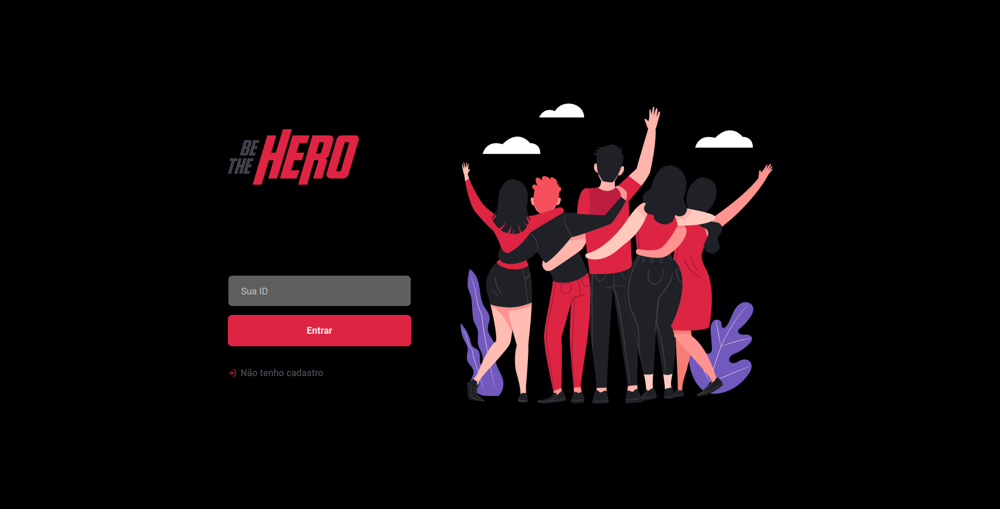
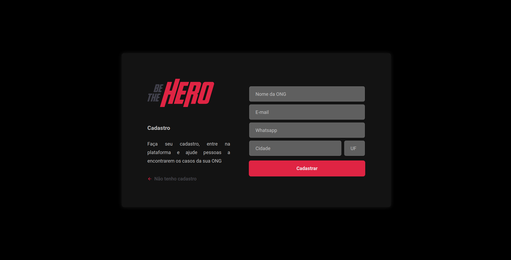
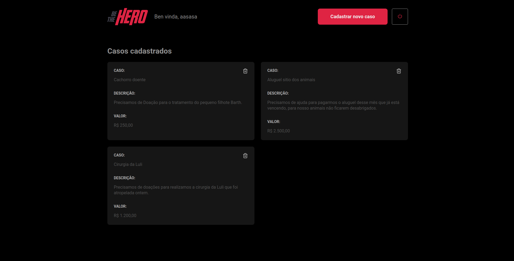
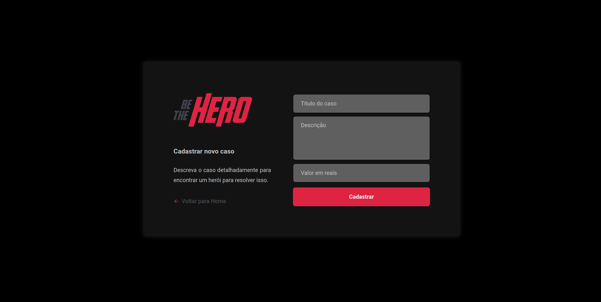

<span align="center">


[](https://github.com/patrickhl94/Projeto_Be_The_Hero/tree/master/backend)
[](https://github.com/patrickhl94/Projeto_Be_The_Hero/tree/master/frontend)
[](https://github.com/patrickhl94/Projeto_Be_The_Hero/tree/master/mobile)

</span>

---
<h3 align="center">

Be The Hero (Seja um herói) é uma aplicação que conecta pessoas que tem vontade de ajudar ONGS doando um valor para tratar algum caso específico.

Nesta aplicação optei por um tema **Dark** nos templates dos *frontends* (Web e Mobile)
</h3>

<h4 align="center">

Esta aplicação for desenvolvida durante o workshop (Semana Omnistack 11 ) ofertado pela ©[Rocketseat](https://rocketseat.com.br/) sendo o instrutor: [Diego Fernandes](https://github.com/diego3g).

</h4>


---

**App feito com [Node JS]() (Backend)**

## Instalar dependências
```bash
npm install ou yarn
```
## Iniciar knex com o arquivo de configuração do banco de dados
```bash
npx knex init ou yarn knex init
```
### Arquivo de configuração **knexfile.js**
```JS
// Update with your config settings.

module.exports = {

  development: {
    client: 'sqlite3',
    connection: {
      filename: './src/database/db.sqlite'
    },
    migrations: {
      directory: './src/database/migrations'
    },
    useNullAsDefault: true,
  },
  
  test: {
    client: 'sqlite3',
    connection: {
      filename: './src/database/test.sqlite'
    },
    migrations: {
      directory: './src/database/migrations'
    },
    useNullAsDefault: true,
  },

  staging: {
    client: 'postgresql',
    connection: {
      database: 'my_db',
      user:     'username',
      password: 'password'
    },
    pool: {
      min: 2,
      max: 10
    },
    migrations: {
      tableName: 'knex_migrations'
    }
  },

  production: {
    client: 'postgresql',
    connection: {
      database: 'my_db',
      user:     'username',
      password: 'password'
    },
    pool: {
      min: 2,
      max: 10
    },
    migrations: {
      tableName: 'knex_migrations'
    }
  }

};
```
## Criar Database
```bash
npx knex migrate:latest ou yarn knex migrate:latest
```
## Iniciar Servidor
```bash
npm start ou yarn start
```
## Estrutura

- `tests/` -> pasta com tetes automatisados
- `tests/unit` -> pasta com tetes unitários
- `tests/Integration` -> pasta com tetes de rotas
- `src/app.js` -> arquivo principal
- `src/routes.js` -> arquivo de rotas 
- `src/server.js` -> arquivo para ativar servidor
- `src/utils` -> funções úteis 
- `src/database` -> arquivos de configuração e conexão com o banco de dados


---

**App feito com [React-Native](https://reactnative.dev/)**

## Instalar dependências
```bash
npm install ou yarn install
```
## Iniciar ambiente de desenvolvimento
```bash
npm start ou yarn start
```


## Estrutura
- `assets/` -> icone e splash screen
- `App.js` -> arquivo principal
- `app.json` -> arquivo de configuração do expo
- `src/assets/` -> imagens do projeto
- `src/pages/` -> páginas do projeto
- `src/pages/Incidents/` -> página de listagem de casos
- `src/pages/Detail` -> página de detalhes de um caso
- `src/routes.js` -> arquivo de configuração de navegação
- `src/services/api.js` -> chamada a api do back-end. Adicione o endereço do servidor back-end da aplicação à [linha 4]() `baseURL: '',`
```javascript
import axios from 'axios';

const api = axios.create({
  baseURL: 'AQUI_VAI_O_ENDEREÇO_DO_SERVIDOR',
});

export default api;
```
_ex:_
```javascript
import axios from 'axios';

const api = axios.create({
  baseURL: 'http://192.168.100.5:3000',
});

export default api;
```

---


**App feito com [React JS](https://reactjs.org/)**


## Iniciar aplicação
```bash
npm start ou yarn start
```

## Deploy
```bash
npm build ou yarn build
```

## Estrutura

- `App.js` -> Arquivo principal

- `src/assets/` -> imagens

- `src/pages/` -> páginas do projeto

- `src/services/api.js` -> chamada a api do back-end.
Adicione o endereço do servidor back-end da aplicação à linha 4 (`baseURL: '',`)
```javascript
import axios from 'axios';

const api = axios.create({
  baseURL: 'AQUI_VAI_O_ENDEREÇO_DO_SERVIDOR',
});

export default api;
```
_ex:_
```javascript
import axios from 'axios';

const api = axios.create({
  baseURL: 'http://127.0.0.1:3000',
});

export default api;
```

- `routes.js` -> arquivo de rotas da aplicação
- `src/pages/Logon/` -> página de logon
- `src/pages/NewIncident` -> página de cadastro de um novo caso
- `src/pages/Profile` -> página de listagem de casos
- `src/pages/` -> página de registro de um novo caso


---
<h1 align="center"> 
 
 **Screenshots do Frontend React JS**

</h1>

_Página de listagem de login_




_Página de cadastro de ONGs_




_Página de casos cadastrados_



_Página para criar um novo caso_



---
<h1 align="center"> 
 
 **Screenshots do Frontend (Mobile) React Native**

</h1>

<h3 align="center"> 

 1° tela: splash | 2° tela: Detalhe do caso | 3° tela: Lista de casos

</h3>

----


